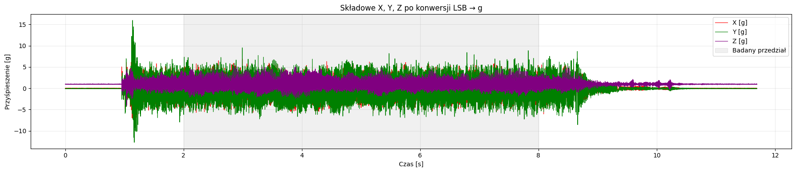
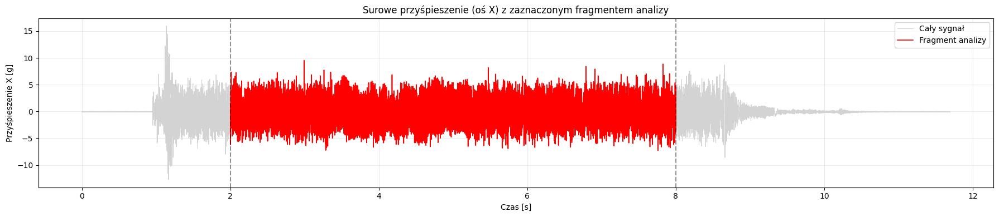
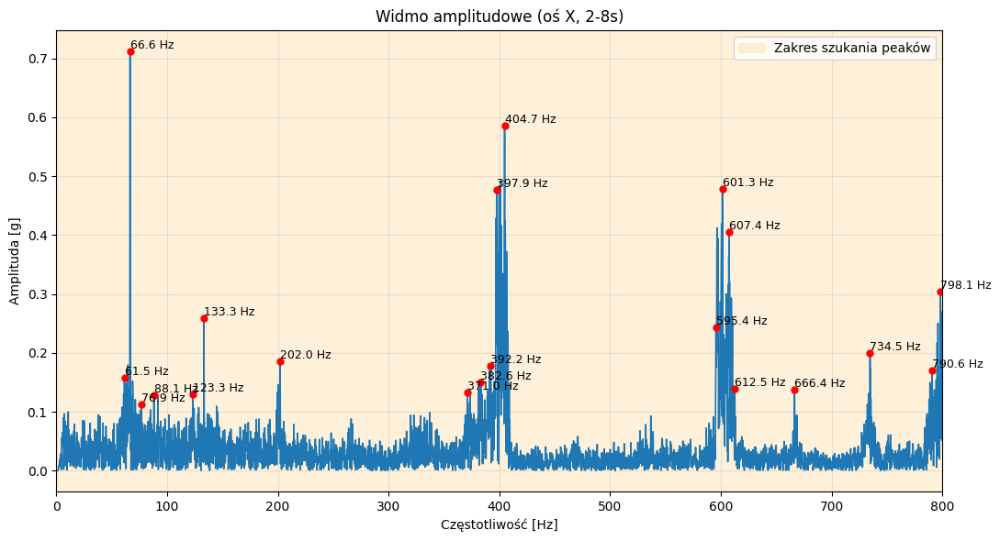

# Wykrywanie zależności w śmigłach w bezzałogowych statkach powietrznych przy użyciu analizy czasowo-częstotliwościowej i modeli uczenia maszynowego

## 1. Wprowadzenie
Projekt polega na wykrywaniu określonych wibracji konstrukcji drona w celu odróżnienia rodzaju materiału oraz uszkodzenia śmigieł. Do tego wykorzystywany jest akcelerometr ADXL345 skomunikowany po magistrali SPI z mikrokontrolerem STM32 NUCLEO-F446RE.
Używany jest również czujnik odbiciowy w celu pomiaru prędkości obrotowej silnika. Dane następnie są wysyłane po magistrali UART do komputera aby tam jest następnie analizować w języku Python.

Najważniejsze programy:
- [main.c](Core/Src/main.c) - program do odczytu danych z akcelerometra i ich wysyłania do komputera
- [logger_bin_fifo.py](Core/Python/logger_bin_fifo.py) - program do zapisu danych do plików `.csv`
- [pre_analysis_fft_stft.ipynb](Core/Python/pre_analysis_fft_stft.ipynb) - wstępna analiza badanego sygnału, jego widma oraz krótkoczasowej transformaty Fouriera (STFT)
- [Detekcja_uszkodzenia.ipynb](Core/Python/Detekcja_uszkodzenia.ipynb) - analiza danych śmigła zdrowego i uszkodzonego oraz wstępna ekstrakcja cech.
- [Detekcja_materiału.ipynb](Core/Python/Detekcja_materiału.ipynb) - analiza danych śmiegieł wykonanych z dwóch różnych materiałów oraz zaimplementowanie modelu uczenia maszynowego w celu identyfikacji materiału

## 2. Środowisko

- STM32CubeIDE (for Visual Studio Code)
- Mission Planner
- Python 3.12, biblioteki: `pandas`, `numpy`, `matplotlib`, `scipy`, `pywt`, `scikit-learn`, `joblib`, `serial`, `csv`

## 3. Sposób akwizycji danych

Po wgraniu programu na mikrokontroler z `main.c` oraz komunikacji drona z programem **Mission Planner**, używamy `logger_bin_fifo.py` do zapisu danych z akcelerometra. Program ten uruchamiamy i uruchamamiamy dany silnik (w tym przypadku "Motor Test").
Po zakończonych testach silników zatrzymujemy pomiar **Ctrl+C** na konsoli. Dane znajdują się we wcześniej określonym przez nas lokalizacji pliku `.csv` i są gotowe do dalszej analizy. 

Dane są w następującej formie:

``` text
czas [s],X,Y,Z,rpm
0.0,-24,2,244,0
0.0006250000001273293,0,-12,242,0
0.0012499999997999112,0,-16,240,0
0.0018749999999272404,-14,-18,238,0
0.0025000000000545697,-12,-8,256,0
0.003125000000181899,-16,-10,244,0
0.003749999999854481,6,-30,238,0
```
### Dane można wstępnie podejrzeć w programie [pre_analysis_fft_stft.ipynb](Core/Python/pre_analysis_fft_stft.ipynb)







## 4. Prowadzone badania
Tutaj odsyłam do szczegółowych analiz sygnałów z modelami uczenia maszynowego. Analizy te:
- wyodrębniają fragmenty sygnałów odpowiadające **stabilnej pracy** silnika,
- porównują widma sygnałów w celu sprawdzenia powtarzalności pomiarów,
- prezentują wyniki analizy czasowo-częstotliwościowej, m.in. krótkoczasowej transformaty Fouriera (STFT) oraz ciągłej transformaty falkowej (CWT),
- wyodrębniają cechy na potrzeby modeli uczenia maszynowego.

[Detekcja materiału](Core/Python/Detekcja_materiału.ipynb) - gotowa analiza z użyciem modelu uczenia maszynowego do określenia materiału śmigła.

[Detekcja uszkodzenia](Core/Python/Detekcja_uszkodzenia.ipynb) - analiza sygnałów wraz ze wstępnym wyodrębnieniem cech do modelu uczenia maszynowego.

